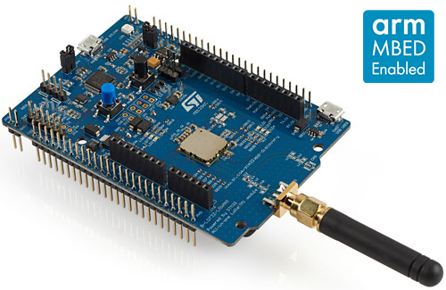
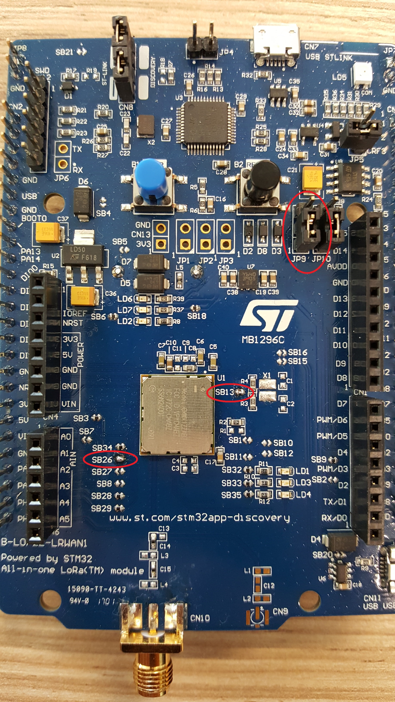
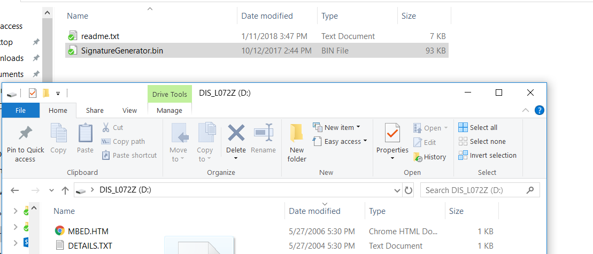
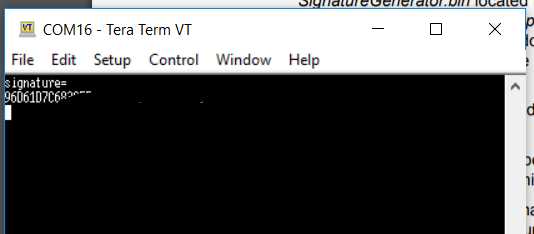
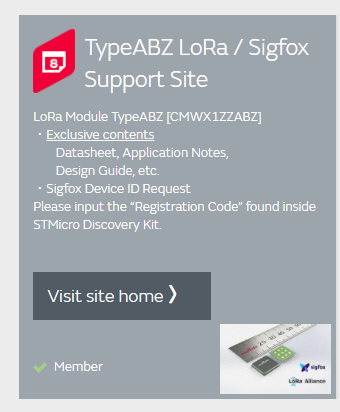
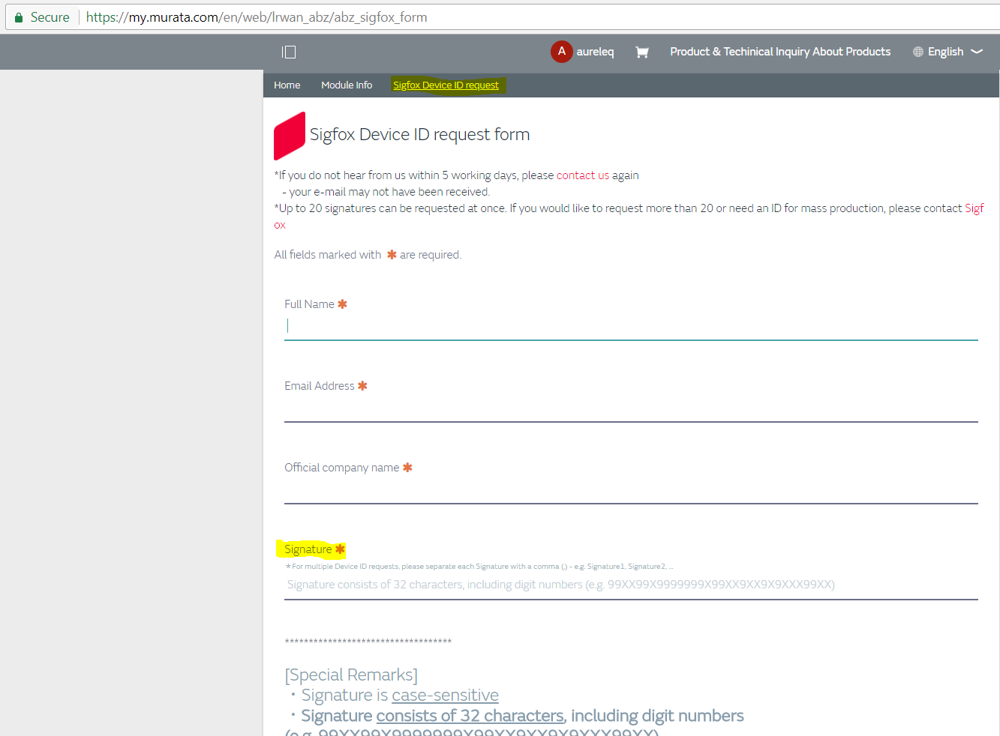
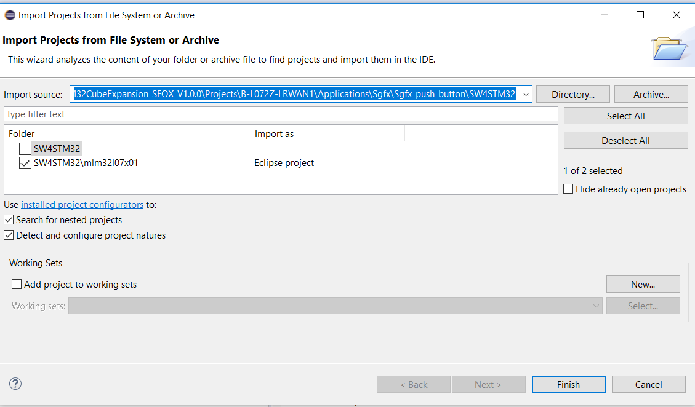
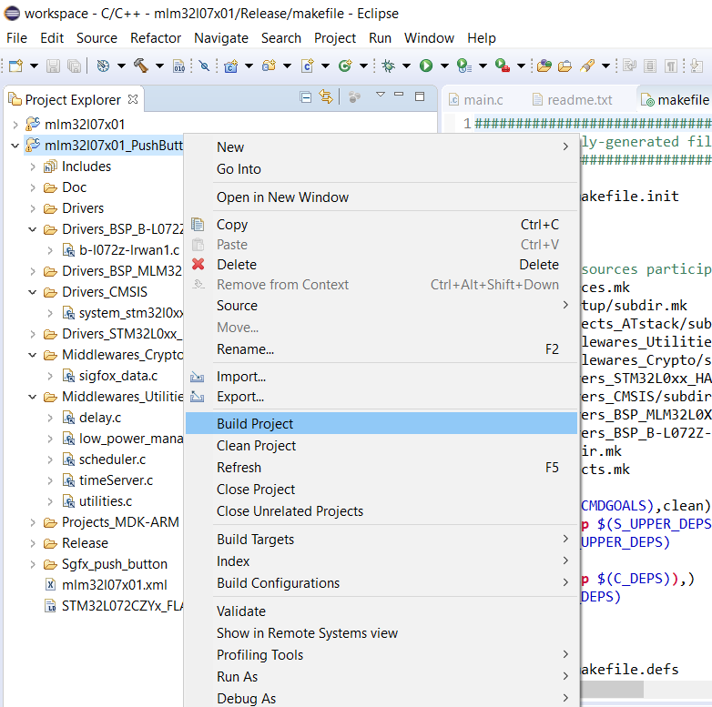
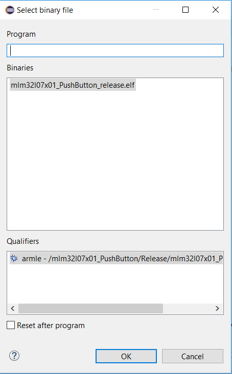

# Getting started with muRata module and Sigfox

## Introduction

muRata module CMWX1ZZABZ is a dual mode LoRa/Sigfox including a low power STM32 MCU. This tutorial explains how to create your first Sigfox application using open-source IDE System Workbench. Hardware used is the discovery kit STM32L072 (http://www.st.com/en/evaluation-tools/b-l072z-lrwan1.html) by ST but tutorial should also work with other boards.

 

## Prerequisites

* Eval kit CMWX1ZZABZ or other board with ST Link embedded
* System Workbench IDE (http://www.openstm32.org/HomePage)
* X Cube Sigfox software expansion from ST (http://www.st.com/content/st_com/en/products/embedded-software/mcus-embedded-software/stm32-embedded-software/stm32cube-expansion-packages/x-cube-sfox.html)

## Prepare the hardware kit

A few hardware modifications need to be done to prepare the board.
Bridges SB13 and SB26 need to be soldered. Also jumper JP9 must be connected on pins 1 and 2:

 

## Getting Sigfox ID and Keys for your module

First step is to retrieve the specific signature of your murata module. To do so, open the X-Cube-Sfox package previously downloaded. Browse to "Projects\B-L072Z-LRWAN1\Applications\Sgfx\SignatureGenerator\" and copy SignatureGenerator.bin to your board (the board should be seen as an external drive):

 

Once the file is transferred, open the COM port using a terminal application and reboot the board. Signature will be displayed in the terminal:

 

Through my.murata website, you can request up to 20 Sigfox IDs for your dev kit / custom board. To do so, register on https://my.murata.com, then request to have access to "TypeABZ LoRa / Sigfox Support Site":  

 

Once access granted, you can fill the Sigfox ID request form and copy the signature previously retrieved:

As mentioned by the website, it may take a few days to then receive the email from murata with the sigfox_data.h file.

## Compiling example Projects

Open System Workbench IDE, and import a new project (File => Import projects from file system). Select for instance the PushButton project from X-Cube package, subdirectory SW4STM32: *\\\STM32CubeExpansion_SFOX_V1.0.0\Projects\B-L072Z-LRWAN1\Applications\Sgfx\Sgfx_push_button\SW4STM32*

 

Select the mlm32xxxx Eclispe project and import.

Once imported, right click on the PushButton project and select *Build Project*:

 

By default, project is using a Sigfox default ID = 78563412. This can be used as a first step if you have a Sigfox SDR Dongle to test the communication.
To use your real ID, you need to copy the sigfox_data.h sent by murata, and copy it in the following directory: *\\\STM32CubeExpansion_SFOX_V1.0.0\Projects\B-L072Z-LRWAN1\Applications\Sgfx\Sgfx_push_button\inc*

Rebuild the project to take into account the new ID and PAC information.

Last step is to flash the code on the board. To do so, right click on the project and select: *Target => Program chip*

 

The module is now programmed with PushButton application.

## Registering board on Sigfox backend

With the Push Button application loaded on the board, open the COM port in a terminal. Push the black button to display ID and PAC information of your board:

Go to https://backend.sigfox.com/activate to register your board.
Select muRata as provider, pick your country and enter your ID and PAC data.
The device is now ready to communicate with the network.

To test communication with Push Button application, push the Blue Button to send a random payload of 7 bytes:

## Next steps

* Create your own application based on PushButton or ATCommand template
* Load both LoRa and Sigfox stacks on same module to switch between both technologies (coming next)
